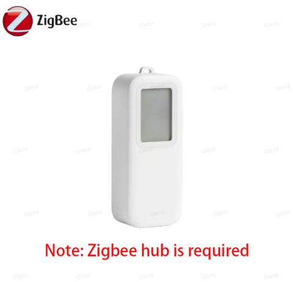

# Tuya/Wing TS0201 Zigbee Temperature & Humidity Sensor Driver

A Hubitat Elevation driver for the Tuya/Wing TS0201 Zigbee temperature and humidity sensor with LCD display (TZ-Z3TH13_GA).

## Supported Device

| Model | Manufacturer |
|-------|--------------|
| TS0201 | `Wing` |
| TZ-Z3TH13_GA | Tuya TS0201 variant |

The device reports:
- Temperature
- Relative humidity
- Battery percentage
- Battery voltage

---

## Installation

1. In Hubitat, go to **Drivers Code → New Driver**
2. Paste the contents of `TZ-Z3TH13_GA.groovy` and click **Save**
3. Pair your sensor to Hubitat as usual — it should auto-match via the fingerprint
4. If it doesn't auto-match, go to the device page and manually select **Tuya TS0201 Temp/Humidity Sensor with LCD**
5. Click **Refresh** to initialise reporting and push the default Zigbee reporting intervals

---

## Zigbee Clusters

| Cluster | Purpose |
|---------|---------|
| `0x0000` | Basic |
| `0x0001` | Power Configuration / Battery |
| `0x0402` | Temperature Measurement |
| `0x0405` | Relative Humidity Measurement |

---

## Attributes

| Attribute | Type | Unit | Description |
|-----------|------|------|-------------|
| `temperature` | number | °C / °F | Ambient temperature |
| `humidity` | number | % RH | Relative humidity |
| `battery` | number | % | Battery percentage |

---

## Preferences

| Setting | Description | Default |
|---------|-------------|---------|
| Temperature Offset | Added to raw temperature reading | 0.0 |
| Humidity Offset | Added to raw humidity reading | 0.0 |
| Enable Debug Logging | Logs raw Zigbee parsing and reporting activity (auto-disables after 30 min) | false |
| Enable Description Text Logging | Logs human-readable sensor updates | true |

---

## Reporting Configuration

The driver automatically configures Zigbee reporting whenever the device is installed, updated, or configured.

### Temperature Reporting
- Minimum interval: 10 seconds
- Maximum interval: 300 seconds
- Reportable change: 0.1°C

### Humidity Reporting
- Minimum interval: 10 seconds
- Maximum interval: 300 seconds
- Reportable change: 0.5%

### Battery Reporting
- Minimum interval: 30 seconds
- Maximum interval: 3600 seconds

---

## Battery Handling

The driver supports both standard Zigbee battery reporting attributes:

| Attribute | Description |
|-----------|-------------|
| `0x0021` | Battery percentage remaining |
| `0x0020` | Battery voltage |

Battery percentage (`0x0021`) is preferred when available.

If the device only reports voltage, the driver estimates battery percentage using a 2.1V–3.0V range.

---

## Temperature & Humidity Offsets

Many low-cost Zigbee environmental sensors drift slightly from calibrated instruments.

The driver allows applying offsets directly in preferences:

- Positive values increase readings
- Negative values decrease readings

Examples:
- `-1.5` temperature offset → subtracts 1.5°C
- `+3` humidity offset → adds 3% RH

Offsets are applied before events are generated.

---

## Device Data Values

The driver stores useful diagnostic information in device data values:

| Data Value | Description |
|------------|-------------|
| `lastTemperatureRaw` | Last unadjusted temperature |
| `lastTemperatureOffset` | Applied temperature offset |
| `lastHumidityRaw` | Last unadjusted humidity |
| `lastHumidityOffset` | Applied humidity offset |
| `lastBatteryRaw` | Raw battery percentage attribute |
| `lastBatteryVoltage` | Last reported battery voltage |

Useful for troubleshooting calibration and battery behaviour.

---

## Notes

- Catchall Zigbee frames are intentionally ignored to reduce logging noise
- Temperature values are reported internally in 0.01°C units
- Humidity values are reported internally in 0.01% RH units
- Fahrenheit conversion follows Hubitat location settings automatically
- Some TS0201 variants may require additional fingerprints depending on firmware/manufacturer branding

---

## Refresh Behaviour

The **Refresh** command requests:
- Battery percentage
- Battery voltage
- Temperature
- Humidity

Because this is a sleepy battery-powered Zigbee end device, refresh responses may not be immediate depending on the device wake cycle.

---

## License

MIT License
